<div align="center">
  

  <p>
    <a href="https://www.devbyjose.org"></a>
    <a href="https://www.linkedin.com/in/devbyjose/"></a>
    <a href="mailto:devbyjose@gmail.com"></a>
  </p>
</div>

---

## `$ whoami`

Desarrollador Full Stack en **QALLPA** desde marzo de 2025, en proyectos de
consultoría para clientes del sector público y privado. Trabajo tanto en
desarrollos nuevos como en sistemas que llevan años en producción.

- Desarrollo un **ERP con microservicios** sobre Java 21 y Quarkus.
- Refactoricé procedimientos almacenados y consultas Oracle de alta latencia:
  **70 % menos tiempo de respuesta** en una operación crítica.
- Administro la infraestructura de inferencia de **LLMs con vLLM sobre GPU**.
- Automatizo procesos e integraciones con **n8n**.
- Mantengo un **homelab con Proxmox** donde despliego mis proyectos.
- Curso el 10.º y último ciclo de Ingeniería de Sistemas e Informática en la UTP.

---

## Stack

**Backend**

<p>
  
  
  
  
  
  
</p>

**Frontend**

<p>
  
  
  
  
</p>

**Datos**

<p>
  
  
  
  
  
</p>

**Infraestructura**

<p>
  
  
  
  
  
  
  
  
</p>

**IA y automatización**

<p>
  
  
  
</p>

---

## Proyectos

<table>
<tr>
<td width="50%" valign="top">

### [devbyjose.org](https://github.com/TheJose24/devbyjose.org)

Mi portafolio, construido como un **gestor de ventanas en mosaico dentro del
navegador**, con intérprete de comandos y espacios de trabajo.

Angular 22 sin `zone.js`, todo el estado en señales, ocho rutas prerenderizadas
a HTML estático y un Cloudflare Worker para el formulario.

`Angular 22` `Signals` `SSG` `Cloudflare Workers`

→ **[www.devbyjose.org](https://www.devbyjose.org)**

</td>
<td width="50%" valign="top">

### [HealthyMe](https://github.com/TheJose24/HealthyMe-Backend)

Plataforma de gestión clínica en **microservicios**: Config Server, service
discovery y API Gateway sobre Spring Boot.

Persistencia políglota —MySQL para lo transaccional, MongoDB para los
documentos— y un modelo de lenguaje autoalojado con Ollama.

`Java` `Spring Boot` `Angular 17` `MySQL` `MongoDB` `Ollama` `Jenkins`

</td>
</tr>
<tr>
<td width="50%" valign="top">

### [Euphony](https://github.com/TheJose24/EuphonyApp-Backend)

Plataforma de streaming de audio que lideré aplicando **PMBOK**.

Autenticación centralizada en Keycloak sobre OAuth2 y OIDC. En 2026 migré el
[frontend](https://github.com/TheJose24/euphony-front) a Angular 21 con
componentes standalone y señales.

`Java 21` `Spring Boot` `Keycloak` `PostgreSQL` `Angular 21`

</td>
<td width="50%" valign="top">

### [Homelab](https://www.devbyjose.org/homelab)

Mi infraestructura, donde despliego proyectos y aprendo cómo funcionan las
cosas fuera de `localhost`.

**2 núcleos · 5,7 GB de RAM · 0 puertos expuestos**

`Proxmox VE` `Docker` `LXC` `Cloudflare Tunnels` `Tailscale`

→ **[Topología y métricas](https://www.devbyjose.org/homelab)**

</td>
</tr>
</table>

---

## Actividad

<div align="center">
  <picture>
    <source media="(prefers-color-scheme: dark)" srcset="./assets/serpiente.svg">
    
  </picture>

  <br><br>

  
</div>

<!-- <sub>Ambos gráficos los regenera un <a href="./.github/workflows/perfil.yml">flujo de GitHub Actions</a> dos veces por semana y quedan guardados en este repositorio, así que no dependen de que ningún servicio externo esté disponible.</sub> -->

---

## Homelab

```text
internet
    ╎                       el túnel sale desde dentro:
    ▼                       nada escucha en la red
proxmox-ve 9.2 · debian 13 · 2 núcleos · 5,7 GB
│
├── cloudflared             servicio systemd · 0 puertos abiertos
│
├── vm 100 · vps            debian 13 · 150 GB · arranca con el host
│   └── docker
│       ├── nginx-proxy-manager    proxy inverso · certificados
│       ├── portainer              gestión de contenedores
│       ├── jellyfin               multimedia
│       ├── jenkins                ci / cd · bajo demanda
│       └── keycloak               oauth2 · oidc · bajo demanda
│
├── ct 103 · adguard        dns con filtrado
├── ct 104 · tailscale      malla de acceso remoto
│
└── vm 101/102              plantilla cloud-init y banco de pruebas
```

No es un servidor grande, y eso es justamente lo útil: con 5,7 GB al 91 % de
uso, cada servicio tiene que justificar su memoria. Lo que quiero poder romper
experimentando va en máquina virtual; lo que solo tiene que estar levantado
—el DNS, la VPN— va en contenedor LXC, que comparte kernel y arranca en un
segundo.

→ **[Topología y métricas en vivo](https://www.devbyjose.org/homelab)**
